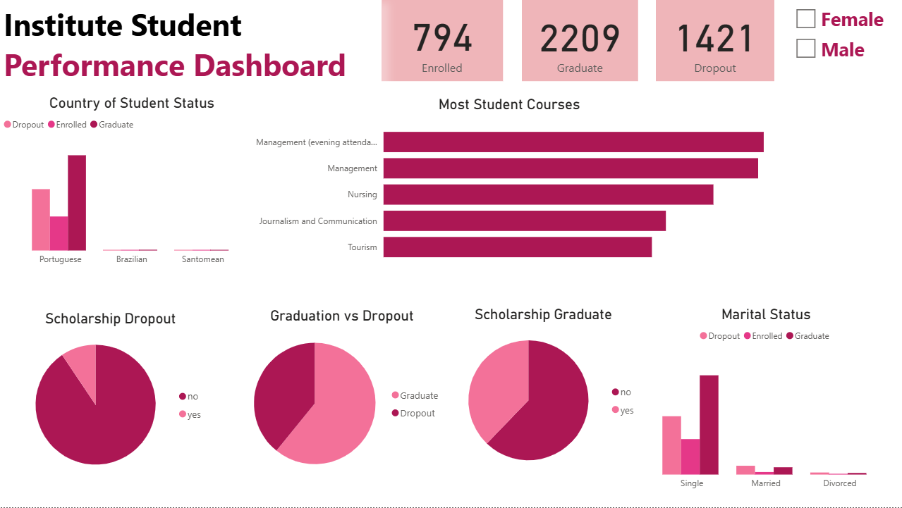

# Proyek-Akhir-Penerapan-Data-Science
## Business Understanding
latar belakang
### Permasalahan Bisnis
...
### Cakupan Proyek
...
### Persiapan
Sumber data: https://github.com/dicodingacademy/dicoding_dataset/blob/main/students_performance/README.md

Setup Environment - Anaconda:
- conda create --name main-ds python=3.9
- conda activate main-ds
- pip install -r requirements.txt
## Business Dashboard

Insight Berdasarkan Data:
...
## Menjalankan Sistem Machine Learning
...
## Conclusion
...
### Rekomendasi Action Items
